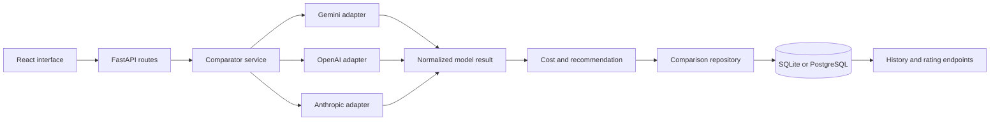

# Architecture

Provider adapters own SDK-specific calls, usage extraction, latency
measurement, and error normalization. The comparator runs synchronous adapters
in parallel worker threads, preserves the requested provider order, and saves
the combined result after all selected calls finish.

The recommendation is deliberately transparent and preliminary. It weights
manual quality at 60%, relative latency at 20%, and relative estimated cost at
20%. Until a result is manually rated, it receives a neutral quality baseline.
